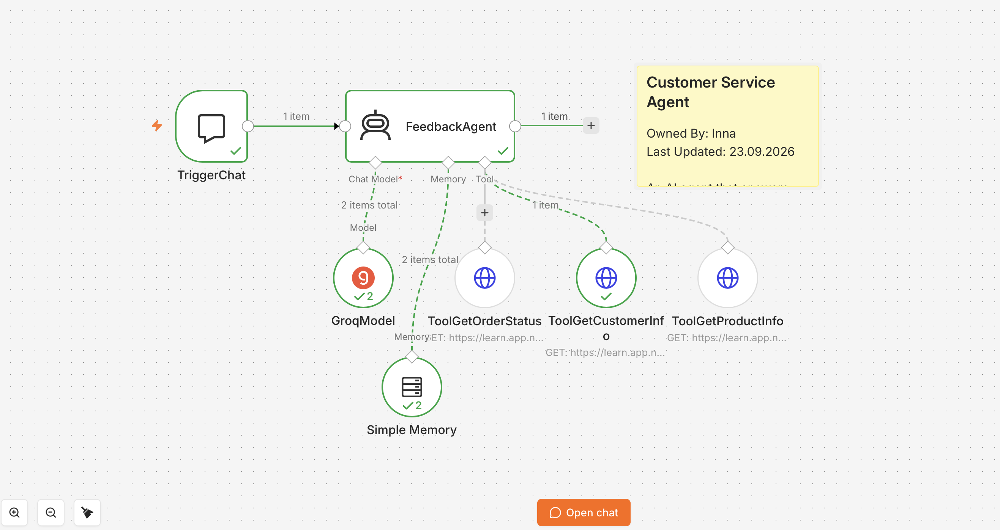
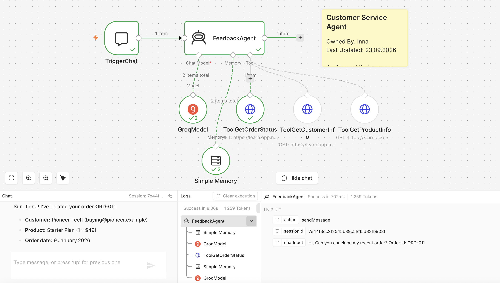
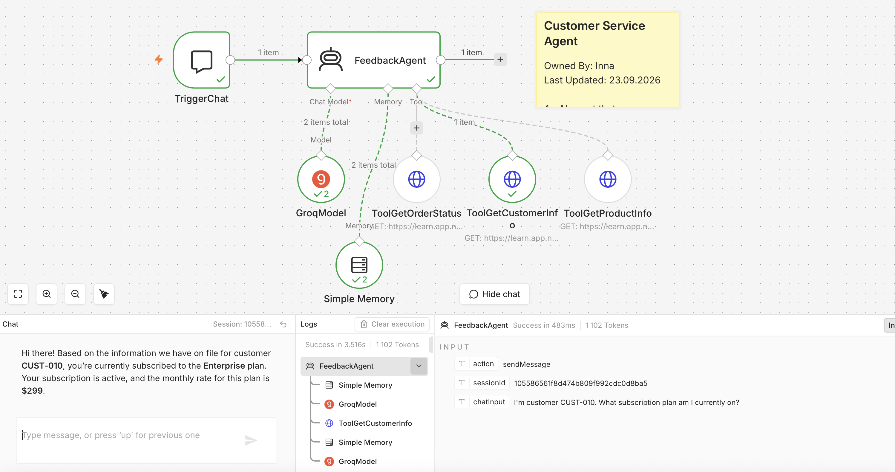
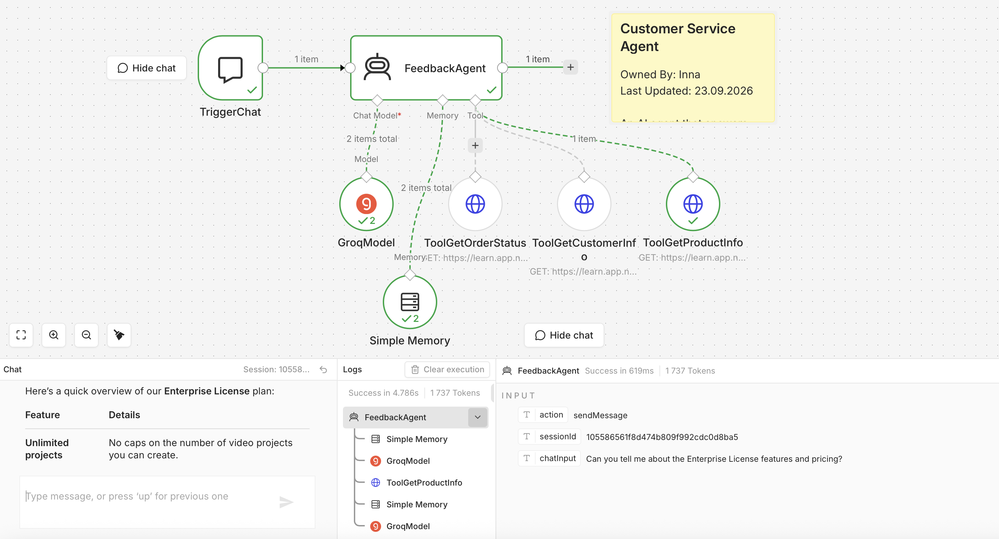
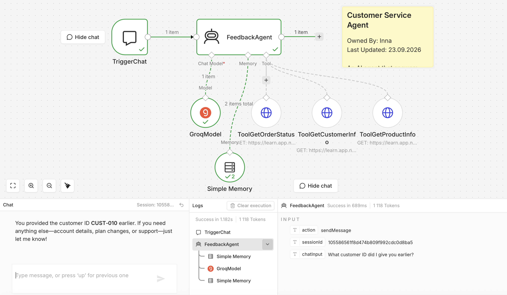

# AI Customer Service Agent with Tools in n8n

An AI-powered customer service workflow built in **n8n**.

The agent understands customer requests, selects the appropriate tool, retrieves external data through HTTP requests, and returns a relevant response. It also uses conversation memory to preserve context across messages.

---

## Project Overview

This workflow demonstrates an **AI Agent architecture** in which the agent dynamically decides which tool to use based on the user's request.

The agent can:

- Check order status
- Retrieve customer account and subscription information
- Look up product features and pricing
- Remember previous messages in the same chat session
- Select the appropriate tool automatically
- Extract required parameters from natural-language requests

---

## Workflow Architecture

```text
TriggerChat
    |
    v
FeedbackAgent
    |
    +-- GroqModel
    |
    +-- Simple Memory
    |
    +-- ToolGetOrderStatus
    |
    +-- ToolGetCustomerInfo
    |
    +-- ToolGetProductInfo
```

### Main Nodes

| Node | Purpose |
|---|---|
| `TriggerChat` | Starts the workflow from the n8n chat interface |
| `FeedbackAgent` | AI Agent that analyzes requests and decides which tool to use |
| `GroqModel` | Language model connected to the AI Agent |
| `Simple Memory` | Stores conversation context during the chat session |
| `ToolGetOrderStatus` | Retrieves order and delivery information |
| `ToolGetCustomerInfo` | Retrieves customer account and subscription details |
| `ToolGetProductInfo` | Retrieves product features, pricing, and specifications |

---

## AI Model

The workflow uses a **Groq Chat Model**.

Model:

```text
openai/gpt-oss-120b
```

The model is connected directly to the AI Agent and is responsible for interpreting requests, deciding when a tool is needed, and generating the final response.

---

## Tool Selection Logic

Each HTTP Request Tool has a dedicated description that helps the AI Agent understand when it should be used.

### Order Status Tool

Used when the customer asks about:

- Order status
- Delivery status
- Shipment information

Required parameter:

```text
order_id
```

Example request:

```text
Hi, can you check on my recent order?
Order id: ORD-011
```

---

### Customer Information Tool

Used when the customer asks about:

- Account information
- Subscription plan
- Subscription status
- Customer details

Required parameter:

```text
customer_id
```

Example request:

```text
I'm customer CUST-010. What subscription plan am I currently on?
```

---

### Product Information Tool

Used when the customer asks about:

- Product features
- Pricing
- Specifications
- Product comparisons

Required parameter:

```text
product_name
```

Example request:

```text
Can you tell me about the Enterprise License features and pricing?
```

---

## AI-Defined Parameters

The agent extracts required values directly from the user's message and passes them to the appropriate HTTP tool.

Example expressions:

```text
{{ $fromAI('order_id', 'Order ID', 'string') }}
```

```text
{{ $fromAI('customer_id', 'Customer ID', 'string') }}
```

```text
{{ $fromAI('product_name', 'Product Name', 'string') }}
```

This allows the workflow to work with natural-language input without hard-coded parameter values.

---

## Conversation Memory

The workflow uses **Simple Memory** to retain context across multiple messages in the same chat session.

Example:

```text
User: I'm customer CUST-010.
User: What customer ID did I give you earlier?
Agent: You provided the customer ID CUST-010 earlier.
```

This allows the agent to reuse information already provided by the user instead of asking for the same details again.

---

## Test Scenarios

The workflow has been tested with multiple customer-service scenarios.

### Order Status

The agent correctly selected:

```text
ToolGetOrderStatus
```

and returned order information for:

```text
ORD-011
```

### Customer Information

The agent correctly selected:

```text
ToolGetCustomerInfo
```

and returned subscription information for:

```text
CUST-010
```

### Product Information

The agent correctly selected:

```text
ToolGetProductInfo
```

and returned Enterprise License information.

### Conversation Memory

The agent successfully remembered previously supplied customer information through:

```text
Simple Memory
```

without requiring the customer to provide the same identifier again.

---

## Screenshots

Recommended repository structure:

```text
screenshots/
├── 01-workflow-overview.png
├── 02-order-status-tool.png
├── 03-customer-info-tool.png
├── 04-product-info-tool.png
└── 05-memory-context.png
```

### Workflow Overview



### Order Status Tool



### Customer Info Tool



### Product Info Tool



### Memory Test



---

## Technologies Used

- n8n
- AI Agent
- Groq Chat Model
- HTTP Request Tool
- REST API
- Header Authentication
- Query Parameters
- Simple Memory
- Prompt Engineering
- Tool Descriptions
- AI-defined parameters with `$fromAI()`

---

## Skills Demonstrated

This project demonstrates practical experience with:

- Building AI Agent workflows in n8n
- Connecting AI models to automation workflows
- Integrating external APIs
- Configuring authenticated HTTP requests
- Designing tool descriptions for agent decision-making
- Extracting structured parameters from natural-language input
- Testing AI tool selection
- Using conversational memory
- Debugging workflow configuration
- Documenting automation workflows

---

## Security

No API keys, credentials, assessment IDs, or other secrets should be stored in the repository.

Credentials should be configured directly inside n8n.

Do not commit:

```text
API keys
Authentication headers
Assessment IDs
Private credentials
Environment secrets
```

---

## Suggested Repository Structure

```text
ai-customer-service-agent-n8n/
├── README.md
├── workflow/
│   └── customer-service-agent.json
└── screenshots/
    ├── 01-workflow-overview.png
    ├── 02-order-status-tool.png
    ├── 03-customer-info-tool.png
    ├── 04-product-info-tool.png
    └── 05-memory-context.png
```

---

## Project Status

**Completed**

The workflow demonstrates:

- AI-based tool selection
- API integration
- Dynamic parameter extraction
- Conversation memory
- Multi-tool customer support automation

---

## Author

**Inna**
